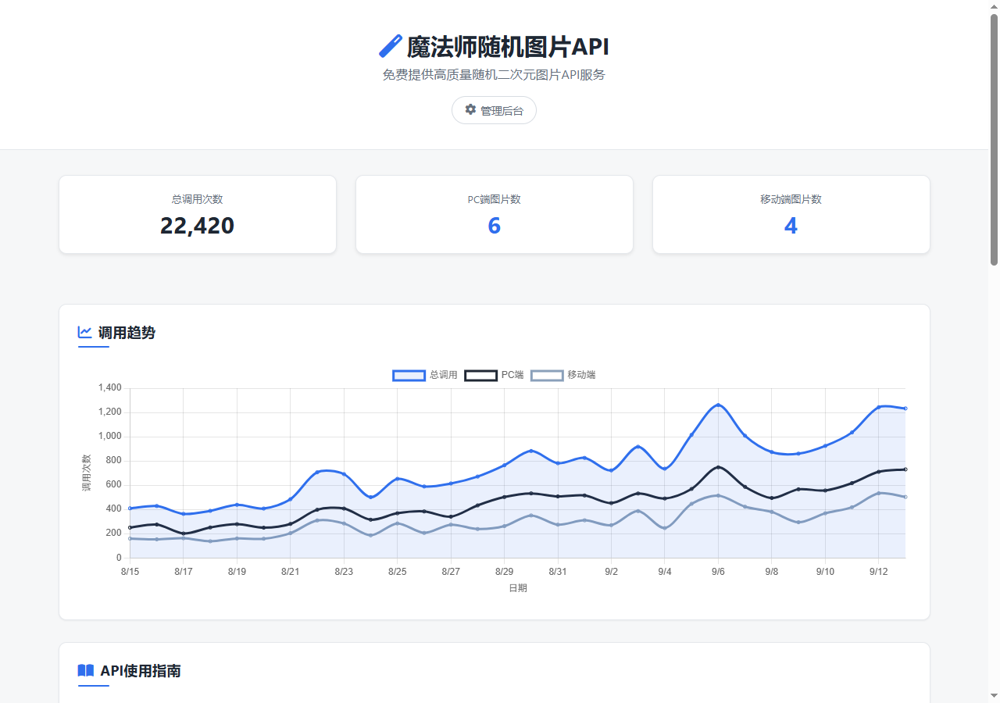
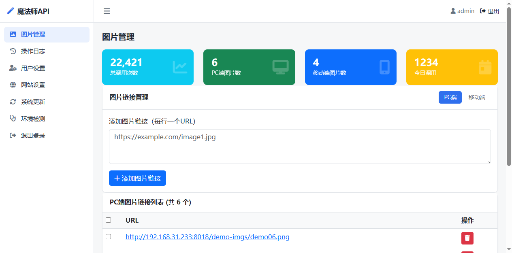

# 魔法师随机图片API


给博客、小程序、桌面软件提供一个"换不完"的图库：纯 PHP + SQLite，传到服务器就能跑，一行 `` 标签接入，自带管理后台和调用统计，不用装 MySQL。

| 项目首页 | 管理后台 |
|---|---|
|  |  |

## 10 秒接入

把下面的标签放进任意网页，每次加载都会换一张图：

```html

```

- 只要 PC 端图库：`pc.php`；只要移动端图库：`pe.php`
- 加缓存：`?cache=3600`（秒数，最长 30 天）

> 接口会 302 跳转到随机图片。若不想暴露真实图床地址，在后台「网站设置」把访问模式切到**代理模式**，图片将由服务器转发，调用方完全看不到原始 URL。

## 核心特性

- **设备自适应**：同一接口自动区分 PC / 移动端，返回不同图库
- **两种出图模式**：302 跳转（零开销）或代理转发（隐藏图床），后台一键切换
- **调用统计**：按日统计调用量与 PC/移动端分布，首页图表直接看趋势，数据自动落库留存
- **管理后台**：图片增删与批量导入、操作日志、站点信息自定义，开箱即用
- **一键在线更新**：基于 GitHub Releases，更新前自动备份，失败自动回滚
- **部署轻**：SQLite 单文件存储，无外部数据库依赖；有 APCu 时自动启用内存计数，高并发更从容

## 快速开始

### 环境要求

- PHP 7.4+（PDO SQLite 扩展，通常默认开启）
- Apache 或 Nginx
- 可选：curl 扩展（代理模式与自动更新）、zip 扩展（自动更新）、APCu（性能加速）

### 安装

```bash
# 方式一：git clone
git clone https://github.com/muziqiu2/img-api.git
# 方式二：下载 Release 包
# https://github.com/muziqiu2/img-api/releases/latest
```

1. 将代码放到站点目录，确保 `data/` 与 `admin/logs/` 目录可写
2. 浏览器访问站点首页即可使用，后台入口为 `/admin/`
3. 建议部署完成后到 后台 → 环境检测 跑一次自检

### 默认账号

用户名 `admin`，密码 `123456`。**首次登录会强制要求修改密码**，请勿使用默认密码跑在生产环境。

### Nginx 用户必读

> [!WARNING]
> 项目自带的 `.htaccess` 仅对 Apache 生效。Nginx 用户必须把下面的规则加进 server 块，
> 否则 `data/app.db`（含后台密码哈希与 GitHub Token）和备份包可被公网直接下载。

```nginx
location ~ ^/(data|admin\/logs)/ { deny all; return 403; }
location ~* \.zip$ { deny all; return 403; }
location ~ /\.     { deny all; return 403; }
```

完整示例见 [`nginx.conf.example`](nginx.conf.example)。

## API 使用说明

| 接口 | 说明 |
|------|------|
| `GET /api.php` | 自动识别设备，返回对应图库的随机图片 |
| `GET /pc.php` | 仅 PC 端图库 |
| `GET /pe.php` | 仅移动端图库 |

| 参数 | 可选值 | 说明 |
|------|--------|------|
| `cache` | 数字（秒） | 浏览器缓存时间，默认 0（不缓存），上限 2592000（30 天） |

> 图片访问模式（302 / 代理）由后台「网站设置」统一控制，调用方无需传参。`format=json` 输出图片地址列表，需在后台开启。

### 调用示例

```html
<!-- 随机图片，1 小时浏览器缓存 -->


<!-- 代理模式效果示例：调用方拿到的始终是你自己的域名 -->

```

## 管理后台

访问 `/admin/` 进入。主要功能：

- **图片管理**：逐条添加或批量导入图片链接，PC / 移动端分类管理
- **操作日志**：记录后台操作的时间、账号与来源 IP
- **网站设置**：站点标题、图片访问模式、JSON 输出开关等
- **系统更新**：检查并一键更新到最新版本，支持备份管理与一键回滚，可配置 GitHub Token（私有仓库必需）
- **环境检测**：PHP 版本、依赖扩展、目录权限、SQLite 版本一键自检

## 安全机制

- SSRF 防护：限制协议与内网地址，校验 DNS 解析、图片 MIME 与文件魔数
- 登录保护：5 次失败锁定 5 分钟，会话 ID 登录后重新生成
- CSRF Token：所有写操作校验；API 与后台独立频率限制（100 次/分钟、10 次/分钟）
- XSS 过滤：用户输入输出统一转义
- 敏感目录（`data/`、`admin/logs/`）默认禁止 Web 访问

## 项目结构

<details>
<summary>展开查看目录结构</summary>

```
img-api/
├── api.php              # 自动识别设备 API
├── pc.php / pe.php      # PC / 移动端专用 API
├── index.php            # 项目首页（统计图表）
├── config.php           # 配置入口：常量定义与 lib 模块装配
├── nginx.conf.example   # Nginx 部署安全配置示例
├── lib/                 # 核心函数模块（db/auth/images/network/stats/update/...）
├── admin/               # 管理后台（登录、dashboard 与 views/ 各功能视图）
├── update/              # 自动更新系统（updater.php / migrations.php）
├── public/              # 静态资源
└── data/                # 运行数据（SQLite、缓存、备份、更新临时目录）
```

自 v3.2.2 起 `config.php` 收敛为配置入口，业务函数按职责拆分至 `lib/`，后台各功能区块拆分至 `admin/views/`。
</details>

## 技术栈

PHP · SQLite · Bootstrap 5 · jQuery · Chart.js · GitHub Releases API

## 许可证

[MIT License](LICENSE) —— 可自由使用、修改、商用与再分发，仅需保留版权声明。
